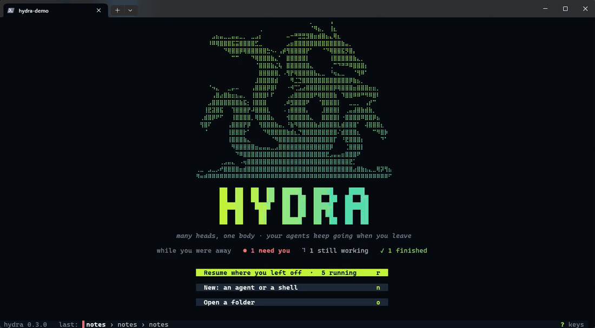
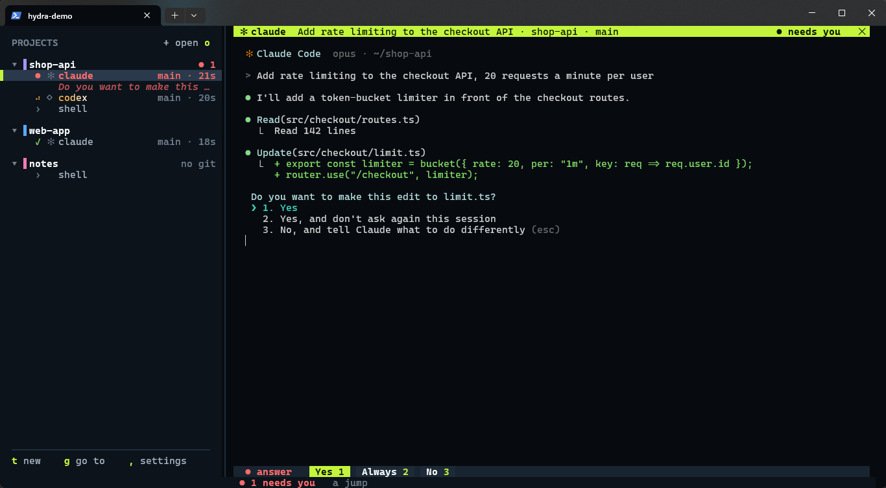
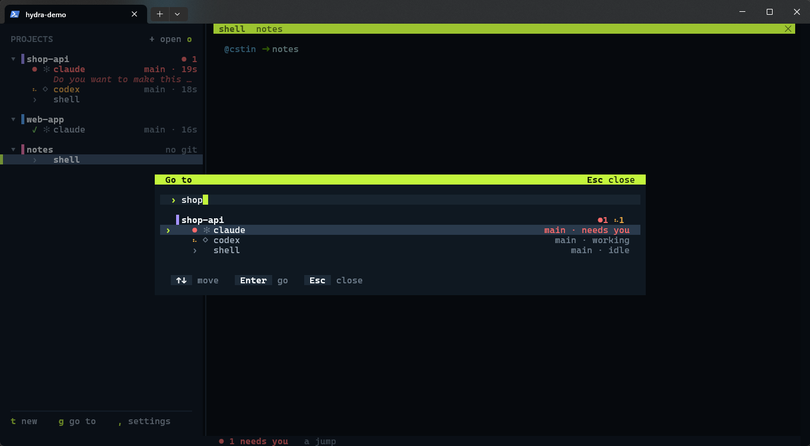
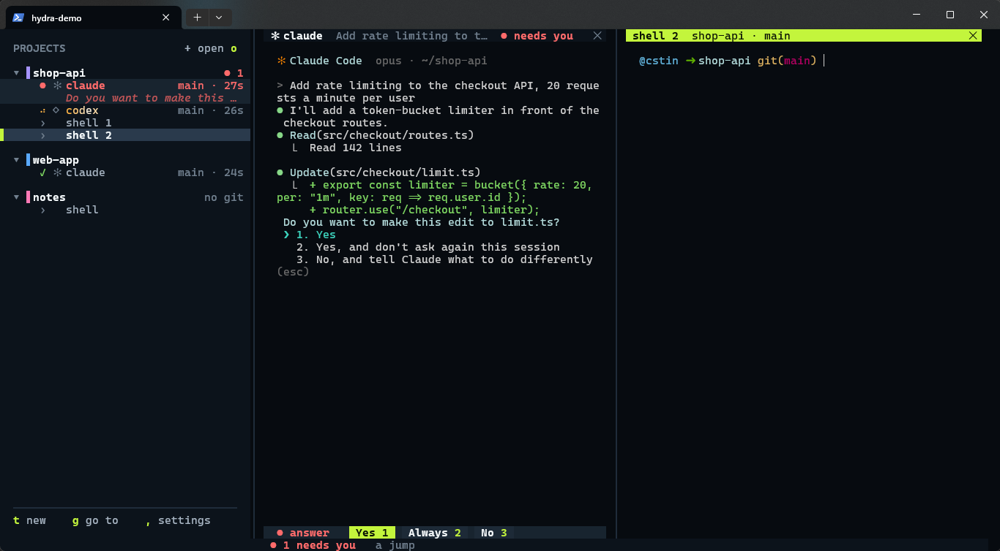
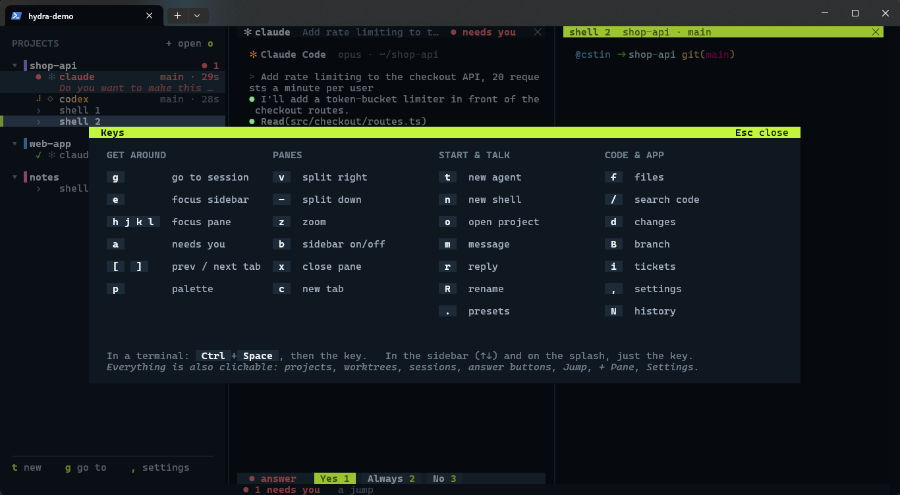

<h1 align="center">hydra</h1>

<p align="center"><strong>Many heads, one body.</strong> A terminal multiplexer for running lots of coding agents at once.</p>

<pre align="center">
⠀⠀⠀⠀⠀⠀⠀⠀⠀⠀⠀⠀⠀⠀⠀⠀⠀⠀⠀⠀⠀⠀⠀⠀⠀⠀⠀⠀⠀⡀⠀⠀⠀⠀⢠
⠀⠀⠀⠀⠀⠀⠀⠀⠀⠀⠀⠀⠀⠀⠀⠀⢀⠀⠀⠀⠀⠀⠀⠀⠀⠀⠀⠀⠀⠈⠻⣦⡀⠀⢸⣆
⠀⠀⠀⠀⣠⣦⣤⣀⣀⣤⣤⣀⡀⠀⣀⣠⡆⠀⠀⠀⠀⠀⠀⠤⠒⠛⣛⣛⣻⣿⣶⣾⣿⣦⣄⢿⣆
⠀⠀⠀⠸⠿⢿⣿⣿⣿⣯⣭⣿⣿⣿⣿⣋⣀⠀⠀⠀⠀⠀⠀⣠⣶⣿⣿⣿⣿⣿⣿⣿⣿⣿⣿⣿⣿⣷⣤⡀
⠀⠀⠀⠀⠀⠀⠀⠙⢿⣿⣿⡿⢿⣿⣿⣿⣿⣿⣓⠢⠄⢠⡾⢻⣿⣿⣿⣿⡟⠁⠀⠀⠈⠙⢿⣿⣿⣯⡻⣿⡄
⠀⠀⠀⠀⠀⠀⠀⠀⠀⠉⠉⠀⠀⠀⠙⢿⣿⣿⣿⣷⣄⠁⠀⣿⣿⣿⣿⣿⡇⠀⠀⠀⠀⠀⢸⣿⣿⣿⣿⣿⣷⣄⡀
⠀⠀⠀⠀⠀⠀⠀⠀⠀⠀⠀⠀⠀⠀⠀⠈⣿⣿⣿⣷⣌⢧⠀⣿⣿⣿⣿⣿⣿⣄⠀⠀⠀⠀⢀⠉⠙⠛⠛⠿⣿⣿⣿⡆
⠀⠀⠀⠀⠀⠀⠀⠀⠀⠀⠀⠀⠀⠀⠀⠀⣿⣿⣿⣿⣿⡀⠠⢻⡟⢿⣿⣿⣿⣿⣧⣄⣀⠀⠘⢶⣄⣀⠀⠀⠈⢻⠿⠁
⠀⠀⠀⠀⠀⠀⠀⠀⠀⠀⠀⠀⠀⠀⠀⣸⣿⣿⣿⣿⣾⠀⠀⠀⠻⣈⣙⣿⣿⣿⣿⣿⣿⣿⣿⣿⣿⣿⣿⡿⣷⣦⡀
⠀⠀⠀⠈⠲⣄⠀⠀⣀⡤⠤⠀⠀⠀⢠⣿⣿⣿⡿⣿⠇⠀⠀⠐⠺⢉⣡⣴⣿⣿⣿⣿⣿⣿⣿⡿⢿⣿⣿⣿⣶⣿⣿⣿⣶⣶⡀
⠀⠀⠀⠀⢠⣿⣴⣿⣷⣶⣦⣤⡀⠀⢸⣿⣿⣿⠇⠏⠀⠀⠀⢀⣴⣿⣿⣿⣿⣿⠟⢿⣿⣿⣿⣷⠀⠹⣿⣿⠿⠿⠛⠻⠿⣿⠇
⠀⠀⠀⣠⣿⣿⣿⣿⣿⣿⣿⣷⣯⡂⢸⣿⣿⣿⠀⠀⠀⠀⢀⠾⣻⣿⣿⣿⠟⠀⠀⠈⣿⣿⣿⣿⡇⠀⠀⣀⣀⡀⠀⢠⡞⠉
⠀⠀⢸⣟⣽⣿⣯⠀⠀⢹⣿⣿⣿⡟⠼⣿⣿⣿⣇⠀⠀⠀⠠⢰⣿⣿⣿⣿⡄⠀⠀⠀⣸⣿⣿⣿⡇⠀⢀⣤⣼⣿⣷⣾⣷⡀
⠀⢀⣾⣿⡿⠟⠋⠀⠀⢸⣿⣿⣿⣿⡀⢿⣿⣿⣿⣦⠀⠀⠀⢺⣿⣿⣿⣿⣿⣄⠀⠀⣿⣿⣿⣿⡇⠐⣿⣿⣿⣿⠿⣿⣿⡿⣦
⠀⢻⣿⠏⠀⠀⠀⠀⢠⣿⣿⣿⡟⡿⠀⠀⢻⣿⣿⣿⣷⣤⡀⠘⣷⠻⣿⣿⣿⣿⣷⣼⣿⣿⣿⣿⣇⣾⣿⣿⣿⠁⠀⢼⣿⣿⣿⣆
⠀⠀⠈⠀⠀⠀⠀⠀⢸⣿⣿⣿⡗⠁⠀⠀⠀⠙⢿⣿⣿⣿⣿⣷⣾⣆⡙⣿⣿⣿⣿⣿⣿⣿⣿⣿⠌⣾⣿⣿⣿⣆⠀⠀⠀⠉⠻⣿⡷
⠀⠀⠀⠀⠀⠀⠀⠀⢸⣿⣿⣿⣷⣄⠀⠀⠀⠀⠀⠈⠻⣿⣿⣿⣿⣿⣿⣿⣿⣿⣿⣿⣿⣿⣿⡏⠀⠘⣟⣿⣿⣿⡆⠀⠀⠀⠀⠙⠁
⠀⠀⠀⠀⠀⠀⠀⠀⠀⠻⣿⣿⣿⣿⣿⣶⣤⣤⣤⣀⣠⣿⣿⣿⣿⣿⣿⣿⣿⣿⣿⣿⣿⣿⡿⠀⠀⠀⢈⣿⣿⣿⡇
⠀⠀⠀⠀⠀⠀⠀⠀⠀⠀⠙⠿⣿⣿⣿⣿⣿⣿⣿⣿⣿⣿⣿⣿⣿⣿⣿⣿⣿⣿⣿⣿⣿⣟⣠⣤⣤⣶⣿⣿⣿⠟
⠀⠀⠀⠀⠀⠀⢀⣠⣤⣄⠀⠠⢶⣿⣿⣿⣿⣿⣿⣿⣿⣿⣿⣿⣿⣿⣿⣿⣿⣿⣿⣿⣿⣿⣿⣿⣿⣿⣿⣟⡁
⢀⣀⠀⣠⣀⡠⠞⣿⣿⣿⣿⣶⣾⣿⣿⣿⣿⣿⣿⣿⣿⣿⣿⣿⣿⣿⣿⣿⣿⣿⣿⣿⣿⣿⣿⣿⣿⣿⣿⣿⣴⣿⣷⣦⣄⣀⢿⡽⢻⣦
⠻⠶⠾⠿⠿⠿⠿⠿⠿⠿⠿⠿⠿⠿⠿⠿⠿⠿⠿⠿⠿⠿⠿⠿⠿⠿⠿⠿⠿⠿⠿⠿⠿⠿⠿⠿⠿⠿⠿⠿⠿⠿⠿⠿⠿⠿⠿⠿⠿⠋

      ██  ██  ██  ██  █████   █████    ████ 
      ██  ██  ██  ██  ██  ██  ██  ██  ██  ██
      ██████   ████   ██  ██  █████   ██████
      ██  ██    ██    ██  ██  ██ ██   ██  ██
      ██  ██    ██    █████   ██  ██  ██  ██
</pre>

<p align="center">
  <a href="#install">Install</a> ·
  <a href="#use">Use</a> ·
  <a href="#configure">Configure</a> ·
  <a href="#script-it">Script it</a>
</p>

<p align="center"></p>

<table>
  <tr>
    <td></td>
    <td></td>
  </tr>
  <tr>
    <td align="center">An agent needs you: answer with one key</td>
    <td align="center">Go to any session by typing</td>
  </tr>
  <tr>
    <td></td>
    <td></td>
  </tr>
  <tr>
    <td align="center">Split panes</td>
    <td align="center">Every key on one screen</td>
  </tr>
</table>

Run Claude Code, Codex, Gemini and friends side by side, see which ones need you, jump to them,
and keep them running when you close the window. Native on Windows, macOS and Linux (Omarchy
included). Inspired by [herdr](https://github.com/ogulcancelik/herdr),
[nebula](https://github.com/agentSystemLabs/nebula) and [fut](https://github.com/mikker/fut).

- **Agents keep running after you close the UI.** A background daemon owns every pseudoterminal
  (ConPTY on Windows). `<leader> q` detaches, and running `hydra` again reattaches.
- **Survives restarts.** Sessions are saved as they change; after a reboot `hydra` rebuilds them
  in the right folders and resumes agents (`claude --resume <id>`, `codex resume --last`, ...).
- **One screen for everything.** A sidebar of your projects and the sessions in each (agent icon,
  name, status), panes on the right with tabs and splits, and popups for the rest. The leader is
  `Ctrl+Space`; keys follow herdr's where they overlap (`v`/`-` split, `h j k l` focus, `x` close,
  `z` zoom, `[`/`]` tabs).
- **Find anything.** `<leader> g` goes to any project or session by typing its name,
  `<leader> p` is a command palette in plain words, `<leader> a` jumps to what needs you, and
  `<leader> ?` lists every key.
- **Status at a glance.** Working (yellow, its name shimmering), needs you (red), done (green until
  you look), idle. An alert or a sound tells you when one needs you or finishes out of view.
- **Detection without setup.** The process tree finds `claude`, `codex`, `gemini`, `opencode`,
  `cursor-agent`, `copilot`, `amp`, `qwen`, `aider` and others, and screen patterns tell
  working from blocked. Hooks (`hydra integrate claude`) make it exact.
- **Git without leaving.** New agents get their own worktree; Changes (`d`) shows the diff with
  review marks, then commit, ship, or open a pull request. Files (`f`), find (`F`), search the
  code (`/`), switch branch (`B`).
- **Everything is configurable.** The leader, every binding, commands bound to keys, themes and
  per-colour overrides, icons, the sidebar side, detection patterns and your own agents. Settings
  (`<leader> ,`) save to your config with its comments kept.
- **Scriptable.** `hydra split -- claude`, `hydra send`, `hydra read` and `hydra ls --json`
  work from any shell, including from an agent running inside hydra.

## Install

**macOS, Linux, Omarchy / Arch:**

```sh
curl -fsSL https://raw.githubusercontent.com/CydoEntis/hydra/main/install.sh | sh
```

**Windows (PowerShell):**

```powershell
irm https://raw.githubusercontent.com/CydoEntis/hydra/main/install.ps1 | iex
```

The installers pick the build for your machine, check its checksum, put it in
`~/.local/bin` (Windows: `%LOCALAPPDATA%\Programs\hydra`, added to your PATH) and tell you if
another `hydra` comes first. No admin rights needed. `HYDRA_VERSION=v0.3.0` picks a version;
`HYDRA_INSTALL_DIR` a folder. If scripts are blocked (a locked-down work PC), download the archive
for your machine from [Releases](https://github.com/CydoEntis/hydra/releases) and put `hydra` on your PATH.
To update later: `hydra update` (or `hydra update --check` to just look). Hydra also checks
once a day and says on the splash when a newer version is out; turn that off in Settings
(Check for updates).

Then run `hydra doctor` to check your setup. For the best look: a terminal with true colour and a
[Nerd Font](https://www.nerdfonts.com) (Windows Terminal, Ghostty, Alacritty, WezTerm, iTerm2).
Optional: `git` (worktrees, changes), `gh` (pull requests, issues).

From source (any platform with Rust): `cargo install --git https://github.com/CydoEntis/hydra`.

## Use

```sh
hydra            # attach (starts the server if needed); opens the current dir
hydra ~/code/api # open or switch to that directory
```

The sidebar has a section per kind of session: **AGENTS**, **TERMINALS** and **SSH** (sessions on
another machine). Inside each, sessions are grouped by **where they are working now**: the git
repo they're in (a subfolder counts as its repo) or the folder itself outside git, and for SSH
the machine they're connected to. Nothing to open or set up: `cd` somewhere and the session moves
to that group; start an agent in a shell (or ssh somewhere) and it moves section. A pane split
beside a session stays with it.

```
▾ ▌shop-api                       ●1 ⠹1
   ⚑ race add rate limiting  2
   ◉ main folder · main  #412 ✓
     › shell
   WORKTREES
   ⑂ calm-heron           ⠹ claude 2m
       Rate limit /login
   ⑂ quick-fox            ● codex 40s
       Allow running npm test?
   BRANCHES ▸ 6
▸ ▌web-shop                         ●1
```

- **main folder** is the repo itself on whatever branch it's on; shells open here.
- **WORKTREES**: every new claude / codex gets its own (named for you), so agents never edit the
  same files. One agent per worktree is one row; what it's on, or the question it's asking, is
  under it.
- **BRANCHES** (folded): recent branches not checked out anywhere; click one to open it in a new
  worktree with an agent.
- `#412 ✓` / `#412 ✕±`: the branch's pull request, its checks, and review state. Click it.
- Things that need you sort to the top. Agents asleep (see Settings) show `☾ asleep`.
- Drag a group's name up or down to reorder; click it to fold. With the sidebar focused
  (`Ctrl+Space e`), a row's menu letters work directly: `x` (or Delete) closes, `r` renames,
  `m` messages. The bottom-left says which hydra you're on.

The leader key is `Ctrl+Space`. Press it and wait a moment to see every binding.

| keys (after the leader) | action |
|---|---|
| `g` | **go to** a project or session: type to find it |
| `e` / `a` | focus the sidebar / **Inbox**: everything that needs you; answer a question with its number, Enter goes there, `d` marks a finished one seen |
| `p` (or Space) | **command palette**: type what you want |
| `n` | **new session**: a shell right where you are (run `claude`, `codex`, … in it; hydra sees the agent) |
| `v` / `-` | split right / split down |
| `h j k l` or arrows | focus the pane that way (left past the edge: the sidebar) |
| `x` / `z` / `b` / `y` | close pane / zoom pane / show or hide the sidebar / select text with keys |
| `H J K L` | resize |
| `=` | arrange this tab's panes: split (where you put them) → grid → main and stack → columns (a strip that slides to the pane you're on) |
| `{` / `}` | jump to the previous / next command in the history (shells that mark their prompts: fish, PowerShell in hydra, others with OSC 133) |
| `c` / `]` `[` / `1–9` / `X` | new tab / next, previous tab / go to tab / close tab |
| `m` / `r` / `R` | message an agent / reply to the focused one / rename a session |
| `f` / `F` / `/` | files / find a file / search the code |
| `d` / `B` / `P` / `S` | changes / switch branch / pull request / ship |
| `i` / `I` / `.` / `A` | tickets / ideas / presets / agent tools |
| `,` / `?` / `U` / `N` / `q` | settings / keys / memory / history / detach |

In **Files**: Enter puts the path in the agent's prompt, `e` opens it in your editor (`editor`
in config; nvim, helix … open inside hydra), `y` copies the path. In **Changes**: `c` commit,
`p` open a PR, `v` the PR, `e` editor, `x` mark the file reviewed (it sinks; the mark clears
if the file changes again), `r` reply to the agent. In a **pull request**: Tab for the
diff, `f` hands failing checks and review comments to the branch's agent, `o` opens it on GitHub.

Everything also works with the mouse. Hold Shift to select text with your terminal.

## Panes are real terminals

- **Scroll:** the wheel, or `PageUp` / `PageDown` at a prompt (full-screen programs keep those
  keys), or `Shift+PageUp` / `Shift+PageDown` anywhere. A scrollbar shows when there's history;
  click or drag it. Typing (or clicking for the program) goes back to the bottom.
- **Mouse:** programs that use it (vim, lazygit, htop, full-screen agents) get clicks, wheel and
  drags. Hold Shift to select text yourself.
- **Copy:** drag to select; double-click copies a word, path or link. Programs that copy (OSC 52,
  e.g. Claude's `/copy`, nvim) put it on your clipboard. Ctrl+click opens a link.
- **Images:** `Ctrl+Space V` (or `Ctrl+Space Ctrl+V`, or a paste while an image is on the
  clipboard) saves the image and pastes its path; Claude Code and Codex attach it.
- **Keys:** on Windows, combos plain terminals can't send (Ctrl+Shift+letter, Ctrl+Enter, Ctrl+Tab)
  reach programs exactly, as native key records. Shift+Enter is still a newline for agents.
- **Resize:** text re-wraps to the new width (history included). Programs' cursor shape (bar,
  block, underline) shows. Synchronized redraws are drawn whole, so agents don't flicker.
- **Closing** a pane ends everything running in it, instantly.

## Alerts

A desktop notification and a sound when an agent you're not looking at needs you or finishes,
also when no hydra window is open (the server sends it). Sounds: glass, ping, chime, pop, off,
or a path to your own file (`[notify] sound_needs`, `sound_done`). `hydra test-alert` tries them.

Click a notification to go to its session: hydra comes to the front on it (its split too).
That works for the note inside hydra and the desktop pop-ups on Windows and Linux (on
Omarchy / Hyprland the window is brought forward too); on macOS, install
`terminal-notifier` for clickable ones.

## Sleep

`sleep_after = "1h"` (Settings → Sessions) stops agents that have sat finished or idle that long,
to save memory. They keep their place; open one and it resumes its conversation
(`claude --resume`, `codex resume`).

## Tickets

```toml
[tickets]
sources = ["github", "linear", "plane"]   # tabs, in order
plane_workspace = "my-team"                # Plane's workspace slug
# plane_url / plane_app_url for self-hosted Plane
[tickets.projects]
shop-api = "linear"                        # which tab a project opens on
```

Keys come from `LINEAR_API_KEY` / `PLANE_API_KEY`, or `linear_key` / `plane_key` in
`config.local.toml` (never synced). A new tracker is one more `Source` in `src/client/work.rs`.

## Recipes

```toml
[[recipes]]
name = "feature"
worktree = true                           # its own worktree
run = ["claude", "npm run dev", "lazygit"] # the first is the main one
```

They show up in + New as `⚙ feature`.

## Agents that steer agents (MCP)

```sh
hydra integrate mcp     # registers `hydra mcp` with Claude Code (prints the Codex snippet too)
```

Any agent can then use hydra's tools: `hydra_list` (sessions, status, the question each is
asking), `hydra_read` (a screen), `hydra_send` (type a message), `hydra_answer` (a numbered
prompt), `hydra_start` (a new agent in its own worktree; your screen stays where it was) and
`hydra_interrupt`. There is no merge, push or delete.

You decide how far that goes (Settings → Agents, or `[mcp]`):

```toml
[mcp]
approve = "never"    # never | safe | always: may agents answer "yes" to other agents' prompts?
safe = ["npm test", "cargo test", "git status"]   # with "safe": only prompts that mention these
scope = "project"    # project: only sessions in the calling agent's repo | all
```

## Sync between machines

```sh
hydra sync setup          # first machine: makes a private GitHub repo hydra-config
hydra sync setup          # other machines: picks it up (your old config is kept as a backup)
hydra sync                # pull + push now (it also happens on its own)
```

Shared: `config.toml` and `ideas.json`. Anything for one machine only (a shell path, keys) goes in
`config.local.toml` next to it, which is never synced and wins over `config.toml`.

## Splash and settings

hydra opens on the splash: the hydra, what happened while you were away (`● 2 need you ⠹ 3 still
working ● 1 finished`) and buttons: Resume where you left off (`r`), New session (`n`).
Turn it off in Settings → General. Settings → General → Start folder sets where plain `hydra`
opens (e.g. `~/code`); empty means wherever you run it.

`Ctrl+Space ,` opens **Settings**, with tabs (Tab cycles): General · Sessions · Appearance · Agents ·
Projects · Keys. Values are chips you click (or ←→ / Enter). Appearance has the themes (Default,
PaperColor Dark, Tango Dark, Monokai, Tokyo Night) with live swatches; the theme recolours agent
output's ANSI colours too. On Keys, Enter then press a new key to rebind a shortcut. Projects lists
the folders you opened (Enter forgets one). Everything is saved to `config.toml` (comments kept)
and applies at once.

## Command name clash

`hydra` is also the name of a Linux password-testing tool (THC-Hydra). If you have that installed,
give this one its own name; the app doesn't care what it's called:

```sh
alias hy='~/.cargo/bin/hydra'                          # bash / zsh
Set-Alias hy "$env:USERPROFILE\.cargo\bin\hydra.exe"   # PowerShell ($PROFILE)
```

## Configure

```sh
hydra config init   # writes the annotated example to the config path
hydra config path   # %APPDATA%\hydra\config.toml, or ~/.config/hydra/config.toml
```

See [`config.example.toml`](config.example.toml) for every option. Some highlights:

```toml
prefix = "ctrl+a"
theme = "tokyo-night"          # catppuccin-mocha/latte, tokyo-night, gruvbox, nord, dracula, mono

[theme_overrides]
accent = "#ff9e64"

[keys.prefix]
C = "spawn-right:claude"       # any command, in a split or a new tab
g = "spawn-tab:lazygit"
x = "none"                     # unbind a default

[keys.global]                  # no prefix needed
"alt+h" = "focus-left"

[[agents]]                     # teach it a new agent, or tune a built-in by name
name = "my-agent"
process = ["my-agent"]
working_patterns = ["esc to interrupt"]
blocked_patterns = ["\\(y/n\\)"]
```

## Never leave hydra

| Leader + | Panel | What it does |
|---|---|---|
| `f` | **Files** | *Recent*: files that just appeared in Downloads, Desktop, Documents or the project (docs, zips, screenshots). *Project*: fuzzy search over the project's files. Enter types the path into your prompt; `^O` opens it, `^F` shows it in the file manager, `^Y` copies the path. |
| `t` | **Tasks** | Every worktree task by stage: needs you, ready for review, working, no changes yet. Enter opens **review**: changed files and the diff, then `c` commit, `m` merge into the base branch, `p` push and open a pull request, `r` reply to the agent, `x` throw it away. `n` starts a new task. |
| `i` | **Inbox** | GitHub pull requests (checks, review state, conflicts) and issues via the `gh` CLI, and your Linear tickets when `LINEAR_API_KEY` is set. Enter opens it in the browser; `^T` turns it into a task (a PR is checked out with the agent briefed to fix its checks). |
| `T` | **Toolbox** | What Claude Code, Codex, Cursor and Gemini are set up with for this project: MCP servers, skills, plugins, sub-agents, hooks and instruction files, with where each comes from. Secret values are never shown. Enter opens the config file. |

Typing in a panel filters it; the action keys that would collide with typing use Ctrl.

## Quick prompt

`<prefix> q` opens a box: type the task and press Enter. `Tab` picks the agent (from
`[quick] agents`), `Shift+Tab` picks where it goes:

- **split right / down / new tab**: the agent starts there with your task
- **new worktree**: a branch named after the task (`q/fix-login-bug-3f2a`), its own checkout,
  and the agent working in it
- **this pane's agent**: the text is typed into the agent you're looking at, then Enter

`Alt+Enter` adds a line break. Agents are just commands, so anything works:

```toml
[quick]
place = "worktree"
agents = [
  { name = "claude", command = "claude {prompt}" },
  { name = "codex", command = "codex {prompt}" },
  { name = "opus", command = "claude --model opus {prompt}" },
]
```

## Restarts

The session (workspaces, tabs, splits, each pane's directory and command, agent sessions) is
saved to the data directory a couple of seconds after it changes. On the next start:

- Panes reopen in their last known directory. For PowerShell, that requires your prompt to report it
  via OSC 7 or OSC 9;9, as oh-my-posh and starship can. Other shells are tracked automatically.
- Agents resume. With hooks installed, hydra knows the exact session (`claude --resume <id>`).
  Otherwise it uses the agent's "most recent" form (`claude --continue`, `codex resume --last`).
- Panes started with a command (`spawn-right:lazygit`, `hydra split -- x`) run it again.

`hydra kill-server` keeps the session for next time, and `hydra kill-server --forget` discards it.
Closing every pane yourself also starts fresh. A burst of panes dying at once, as at logoff or a
crash, is not recorded, so the last good layout survives. Configure all of this under `[restore]`,
and per agent with `resume` / `resume_last`.

## Worktrees

```sh
hydra worktree feat/login -- claude      # new branch from HEAD, opened with claude running
hydra worktree fix-123 --base origin/main
hydra worktree-remove [--force]          # closes the workspace and removes the checkout
```

New worktrees go to `{repo_parent}/{repo}-worktrees/{branch}` (set `[worktree] dir`). An existing
local or `origin/` branch is checked out instead of created. Set `[worktree] command = "claude"`
to start an agent in every new worktree.

## Copy mode

| key | |
|---|---|
| `h j k l`, arrows, `w b`, `0 ^ $`, `g G`, `H M L` | move |
| `Ctrl-u/d`, `Ctrl-b/f`, `PgUp/PgDn`, wheel | scroll |
| `v` / `V` | select characters / lines |
| `y`, `Enter` | copy selection (or the current line) and leave |
| `/` `?` then `n` `N` | search forward / backward (smart case) |
| `Tab` / `Shift+Tab` | keep this selection and go to the next / previous pane of the split, the same search there; `y` then copies them all, each under its pane's name |
| `q`, `Esc` | leave |

Copies go to the system clipboard and, through OSC 52, to your outer terminal (works over SSH).

## Agent status

Each pane's process tree is scanned about once a second. Detected agents get a status from
these sources, in order:

1. **Hooks**, which are exact. `hydra integrate claude` adds hooks to `~/.claude/settings.json`.
   They stay inert outside hydra panes and are tagged so a re-run or `--uninstall` replaces them cleanly.
   Any tool can report its own state with `hydra hook <name> --status working|blocked|done|idle`.
   `hydra integrate gemini` and `hydra integrate qwen` do the same for Gemini CLI and Qwen Code;
   `hydra integrate opencode` writes a small opencode plugin that tells hydra what it's doing.
   For Codex, `hydra integrate codex` sets hydra as its `notify` (in `~/.codex/config.toml`;
   another program's notify is left alone).
2. **Screen patterns**: regexes matched against the bottom of the screen, such as "esc to interrupt".
3. **Activity**: recent output that isn't the echo of your own typing.

A turn that finishes while you're looking elsewhere is **done** until you focus that pane.

**An agent hydra doesn't know** (a newer CLI, or one you start with your own alias): right-click
its pane and pick **"… is an agent"**, or run `hydra teach` in it (`hydra teach 4` for pane 4).
Hydra looks at the program actually running, whatever alias started it (or, for a node /
python harness, its package or script), and adds it under `[[agents]]` in your config with the
usual screen signs of working. Edit that entry to tune them.

## Popups

`hydra popup -- fzf` (or `lazygit`, `htop`, any command) opens a floating pane over everything,
in the folder you're in; it has the keys until the command exits, then it's gone.

## Agents asking you

An agent (or any script in a pane) can ask you something with fixed answers and wait:

```sh
hydra ask-human "Deploy to staging?" -o Yes -o "Not yet"   # prints the answer you pick
```

The pane shows **needs you** (with a notification), the question is in the Inbox and on the
pane's answer bar, and a number or click answers. Without `-o` the answers are Yes / No.

## What agents may do

A command an agent runs in its pane (the `hydra` CLI, or `hydra mcp`) acts as that pane, and a
pane may by default **read** other panes, **write** (type) into them and **start** sessions. To
also **respond** (answer another agent's prompt or question) or **admin** (close other panes,
stop hydra), grant it: `hydra grant 4 read,write,start,respond` (`hydra grant 4 default` puts it
back), or change the default in `[mcp] grants`. Only you can grant: not from inside a pane. These
are guardrails for agents that behave, not a sandbox.

## Claude Code agent teams

Claude Code's agent teams can put each teammate in its own pane, through tmux. In a hydra pane
(macOS, Linux):

```sh
hydra tmux-shim -- env CLAUDE_CODE_EXPERIMENTAL_AGENT_TEAMS=1 claude
```

Claude sees a tmux, and every teammate it starts opens as a hydra pane beside it: in the
sidebar under Agents, with its status, in the Inbox. They close when the team is done. The shim
changes nothing outside that command; a real tmux still works inside it. Calls it doesn't
handle yet are logged in `tmux-shim/calls.log` in hydra's data folder.

## Script it

```sh
hydra ls [--json]                      # tree of workspaces / tabs / panes with agent status
hydra split [--down] [-p ID] -- codex  # inside a pane, targets that pane by default
hydra send -p 3 "run the tests"        # types text and presses Enter
hydra read -p 3                        # the pane's screen as text
hydra new ~/code/web -- claude
hydra worktree feat/x -- claude        # worktree workspace for this pane's repo
hydra focus 3 | close 3 | kill-server [--forget]
hydra send -p 3 --wait "fix the bug"   # waits for the turn to end, prints the agent's reply
hydra wait -p 3 [--regex "passed"]     # the turn ending, or text on the screen (exit 2: timeout)
hydra worktree --move [name]           # run by an agent: move itself into a new worktree
hydra dev start|stop|restart           # this worktree's dev server (from .hydra.toml)
hydra ext list | new <name>            # extensions
hydra doctor                           # check everything hydra relies on
hydra --remote me@box                  # the UI here, agents on another machine (any command)
```

`HYDRA_SOCKET=name` runs a separate server, like `tmux -L`.

## How it works

```
hydra (TUI client) ──┐      named pipe (Windows) / unix socket
hydra ls/send/hook ──┼──►   hydra daemon
                      │        ├─ workspace / tab / split-tree model (source of truth)
                      │        ├─ one PTY per pane (portable-pty → ConPTY / openpty)
                      │        │    reader thread → vt100 parser + replay ring
                      │        ├─ answers terminal queries (DSR/DA) itself, even with nobody attached
                      │        ├─ process-tree scanner (sysinfo) → agent detection
                      │        └─ status machine: hooks > screen patterns > activity
```

- `src/daemon/`: event-loop actor; PTYs (`term.rs`); process scan (`scan.rs`); session file
  (`persist.rs`); git status and worktrees (`git.rs`)
- `src/client/`: event loop, keys, actions (`mod.rs`); drawing (`render.rs`); copy mode (`copy.rs`)
- `src/protocol.rs`: length-delimited MessagePack messages
- `src/layout.rs`: split tree, rects, neighbour search
- `src/config.rs`, `src/keys.rs`, `src/theme.rs`: everything user-facing

## Per-repo settings: `.hydra.toml`

Commit one to the repo:

```toml
[dev]
run = "npm run dev"              # right-click a folder > Run dev server, or `hydra dev`
ready = "ready in|listening on"  # the row says "ready" once the output matches
port = 3000                      # each worktree gets its own $PORT: 3000, 3001, ...

[hooks]
on_create = "npm install"        # in every new worktree
on_remove = ""
```

Hooks don't run until you allow them: run `hydra allow` in the repo (it shows the
commands). If they change, they wait for `hydra allow` again, so a cloned repo can't run
code on its own. A hook is stopped after 10 minutes.

## Extensions

`hydra ext new deploy` makes `<config>/extensions/deploy/hydra-ext.toml`: `[[commands]]` show in
the palette (hidden with their last line shown, or in a pane), `[[labels]]` put a short line on
every worktree row, and `[hooks]` run on agent start, agent done, needs you, worktree create
and remove, with `HYDRA_EVENT`, `HYDRA_WORKTREE`, `HYDRA_BRANCH`, `HYDRA_AGENT`, `HYDRA_SAID` and
more set. `./` in a command is the extension's folder.

## Remote

`hydra --remote me@box` runs the UI here and everything else there, over ssh (hydra must be
installed on both; `HYDRA_REMOTE_CMD` if it isn't on the far side's PATH, `HYDRA_SSH="ssh -p
2222"` for options). Panes, agents, worktrees and statuses work; views that read files (Files,
Changes, find, branches) don't yet.

## Roadmap ideas

- Restore scrollback contents after a restart, not just the layout
- Files, Changes and find over `--remote`
- Workspace templates
